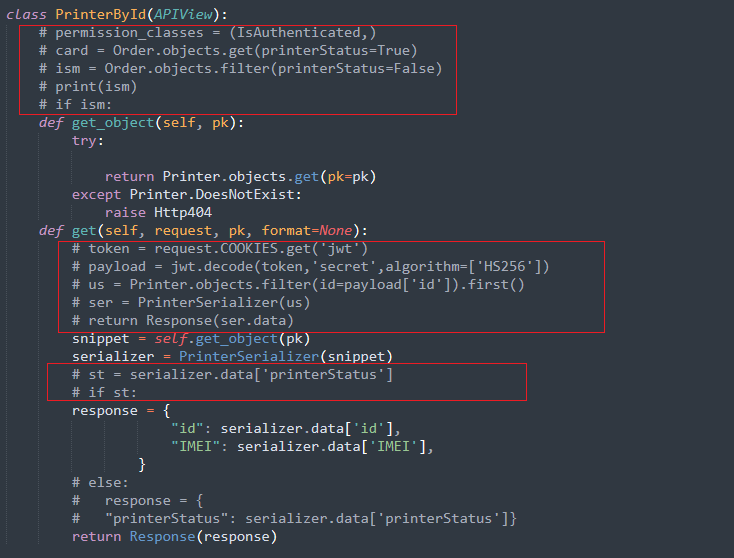
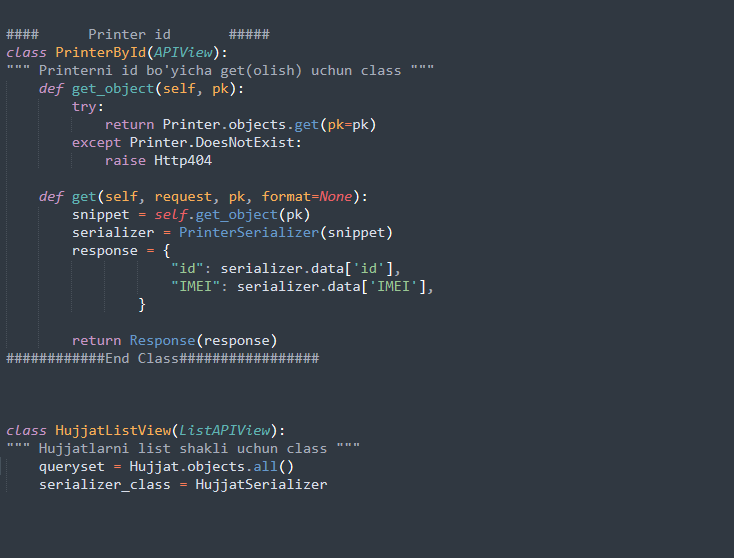
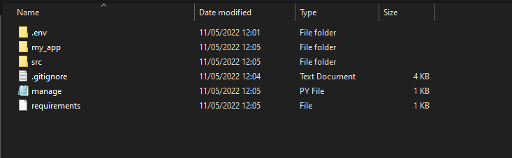
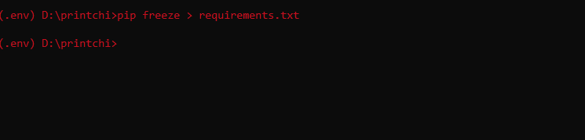
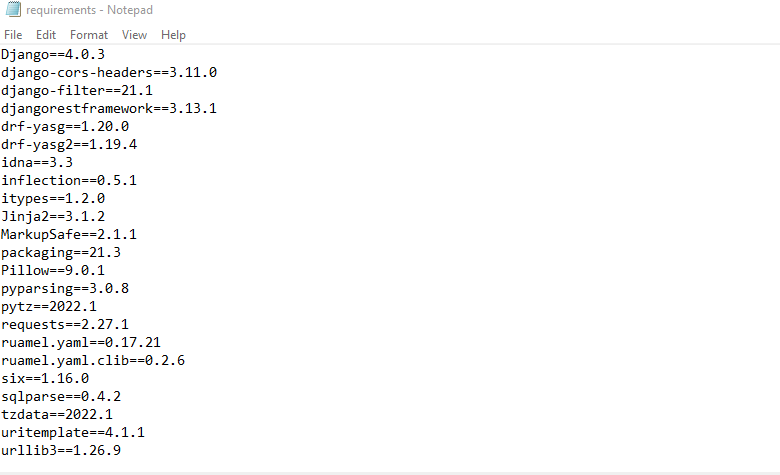
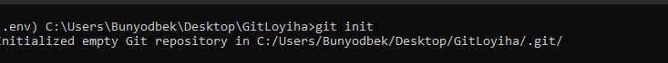
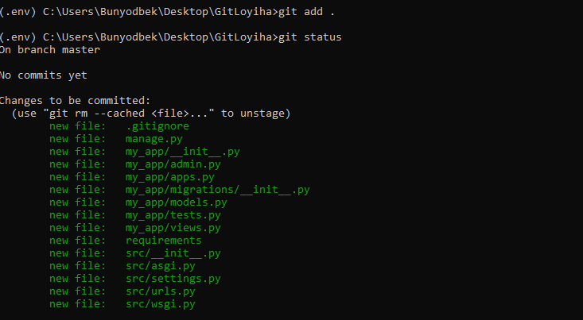
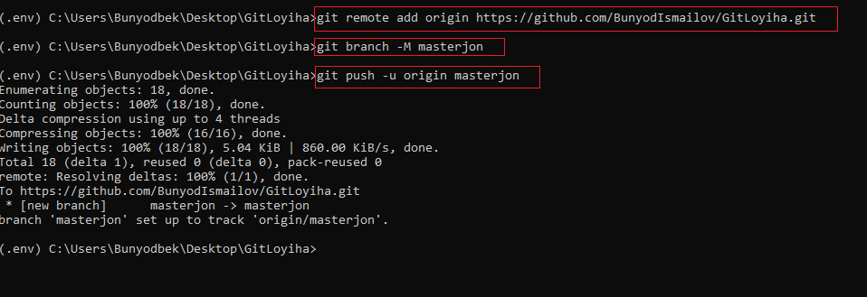

# **GIT-ni ketma-ket sozlamalari** 

# __Birinchi bosqich__
> *Git*-ni o'rnatilganmi yoki yuqmi tekshirish
- ПУСК+R knoplarini bosish orqali  kichik bir oyna ochiladi

Oyna ichiga cmd yozishingiz kerak
-  *OK* kopkani bosing!

- Terminal (cmd) oynasi ochiladi

- git yozing va *Enter*-ni bosing

- rasmdagidek xatolik chiqsa siz ushbu manzildan  👉 [GIT](https://git-scm.com/downloads)-ni yuklab oling(__Windows uchun__) va **Ikkinchi bosqich**-ga o'ting

- agar sizda ushbu ko'rinish chiqsa siz **3-bosqichga** o'tishingiz mumkin

# __Ikkinchi bosqich__
> *Git*-ni o'rnatish
- Rasmlardagi o'zgarishlarni ketma ket bajaring va __install__ qiling 

# __Uchinchi bosqich__
> *SSH* key
- SSH kaliti yordamida biz terminal (cmd) orqali githubga ishonchli tarzda ulanish imkonini beradi
  - yangi terminal (cmd) oching
    - cd Dectop 		(__Ishchi stoliga o'ting__)
      - mkdir .ssh 		(__yangi yashirin papka hosil qiling__)
      	- cd .ssh   	(__hozir yaratgan papka ichiga kiring__)
      	  - ssh-keygen.exe		(__terminal (cmd) -da kalit generatori bor shu yordamida SSH kalit hosil qilamiz__) **Enter** bosing

- yaratilayotgan faylni nomlashni suraydi (__! albatta faylni nomlashingiz kerak__)

- keyingi ketma ketlikda sizda parol o'rnatishni va uni qayta kiritishni suraydi (__parol majburiy emas Enten-ni bosib o'tkazib yuborishingiz mumkin__) 
  - Sariq kursatkich bilan ko'rsatilgandek belgilar paydo bo'lishi sizga SSH kaliti yaratilganini bildiradi(__rasmda kalit belgilari xavfsizlik uchun  berkitilgan__ 🔐)

SSH kalitidan foydalanish
- type C:\Users\(__User_nomi__)\Desktop\.ssh\(__faylingiz_nomi__).pub  		(__windows-da cmd orqali faylning mazmunini ko'rish__) 
  - cat C:\Users\(__User_nomi__)\(__Fayl_joylashuvi__)\.ssh\(__faylingiz_nomi__).pub (__macOS-da cmd orqali faylning mazmunini ko'rish__) 
  	- Qizil bilan ko'rsatilgan qismdan nusxa oling **Github**-da ruxsat berish uchun kerak bo'ladi

- **GITHUB** shaxsiy profilingizdan __Settings__ bo'limiga o'ting
    - SSH and GPG keys 		(__bo'limini tanlang__)
      - New SSH key 		(__knoplani bosing Key qismiga cmd-da ssh faylni mazmunidan olgan copiyangizni shu yerga yuklang__)

-  Add SSH key (__knopkani bosish orqali uni saqlaysiz__)

# __To'rtinchi bosqich__
> *Git*-ning terminal (cmd)-da asosiy sozlamalari

- **GIT**-ni to'g'ri ulanishi uchun terminal (cmd) -da ushbu ketma-ketlikni bajarishingiz zarur

    - git config --global user.name "Your Name"             
      -  Git foydanuvchini nomini (username) yozishingiz kerak 

- davom etamiz...
    - git config --global user.email "you@youraddress.com"  
      -  Git- ga ulangan @mail.ru (email) yozishingiz kerak 

- keyingi ketma ketlik standart sozlamalar 
  - git config --global push.default matching 
  - git config --global alias.co checkout            

# __Beshinchi bosqich__
> **Loyihani** *Git*-ga tayyorlash

- **Eng avvalo** *GIT*-ga yuklamoqchi bo'lgan loyihamizni fayllarini keraksiz kodlardan __tozzalashimiz__ zarur!
    - Keraksiz kodlar:
      - Izohga olingan kodlar (kodlarni izohlash uchun yozilgan izohlar bundan mustasno)
      - Kodlar ichida keraksiz ochiq joylar
      - Turli xil keraksiz yozuvlar (eski ishlatilmaydigan kodlar va test qilingan print yana bazi yozuvlar)
        -  odatda loyihada test qilganimizda print qilamiz va shu qismlarni shunchaki izohga olib ketamiz 

> Albatta kodlarni **Izoh**-ga olib keting sababi sizni kodlaringizni boshqa dasturchi ko'rganda tushunarli bo'lishi yoki kodlaringizni tekshiradigan inson albatta izohlarga ham ahamiyat beradi bu bilan siz tartibli va tushunarli yozasiz,albatta izohlashda English tilida izohlasangiz  bu +5 bo'ladi.

- Loyiha ichidagi fayllarga ham ahamiyat bering keraksiz **fayl** yoki **papkalarni** uchiring va albatta fayllarga to'g'ri nom bering...
  - ❗️ **E'tibor bering...** Virtual environment (__venv__, __.env__) bu fayllarni *Git*-ga **yuklamang!** qo'shimcha fayl yuklab oling [.gitignore](.gitignore)
  - Loyiha fayllari orasida albatta **requirements.txt** fayli bo'lishi kerak sababi sizni loyihangizni yuklagan dasturchi loyiha uchun qanday **paket**-larni yuklash kerakliyligini va qanday version(versiya)-larni ishlatganingizni shu fayldan topadi aks holda loyihani ishga tushurishda muammolar kelib chiqishi mumkin!

> Loyihadagi fayllarini **namuna** ko'rinishi:

- requirements.txt faylni to'g'ri hosil qilish...
Loyihangizni ishga tushiring va Virtual environment(venv, .env) bo'lsa(**albatta muhit hosil qilib ishlang juda foydali**) uni aktivlashtiring va terminal (cmd) orqali
**pip freeze > requirements.txt** buyruqni bering **Enter**-ni bosing fayllaringiz orasiga ushbu faylni yaratib uni ichiga loyihada ishlatilgan **paket**-larni (versiya)si bilan yozib beradi  

- 👇 requirements.txt.. paketlar ni ko'rishingiz mumkin albatta sizni loyihangizda o'z paketlaringiz bo'ladi

# __Oltinchi bosqich__
> **Loyihani *Git*-ga yuklash**

- Loyihangiz **Git**-ga tayyorgarlikdan o'tgan bo'lsa uni yuklashni boshlashimiz mumkin
- Yuklshni terminal (cmd)- dan bajaramiz
- Buyruqlar ketma-ketligi:

  - **git init** 
      - Ushbu buyruq bo'sh Git omborini yaratadi (ya'ni *Git*-ga yuklashga tayyorgarlik)

  - **git add .**
      - fayl tarkibini indeksga qo'shish (indeksni yangilaydi, keyingi topshiriq uchun sahnalashtirilgan tarkibni tayyorlash)

  - **git status**
      - qaysi fayllarda keyingi topshiriq uchun bosqichma-bosqich o'zgarishlar borligi haqida qisqacha ma'lumot olish uchun foydalanish mumkin (qaysi fayllar yuklanganligini ko'rish uchun (buyruq majburiy emas).Yuklangan fayllaringiz rangi rasmdagi rangda bo'lsa demak hammasi yaxshi 😁

  - **git commit -am "Izoh"**
      - ombordagi o'zgarishlarni saqlash va unga izoh berish uchun Izohga odatda loyihangizni keyinchalik qaysidir qismini o'zgartirsangiz izoh bilan uni saqlashingiz mumkin ya'ni izoh sizga qanday o'zgarish bo'lganini yozib ketsangiz jamoadoshlaringiz ham o'zgarishni ko'rishadi

  - **git remote add origin https://github.com/Your_Name/git.git**
      - ushbu urlni *Git* sahifangizdan olishingiz mimkin.Siz hosil qilgan (__repositori__) nomi bo'ladi

  - **git branch -M branch_name**
      - branch nomi odatda **master** (nomi standart beriladi) agar o'zingiz o'zgartirmagan bo'lsangiz albatta(masterjon 😉) \

  - **git push -u origin master**
      - Berilgan referatlarni bajarish uchun zarur bo'lgan ob'ektlarni jo'natish bilan birga, mahalliy referatlar yordamida masofaviy referentlarni yangilaydi,ya'ni loyihangizni **Git**-ga yuklash so'nggi bosqichi 

# __Yettinchi bosqich__
> **Loyihani Update(yangilangan fayllarni ) *Git*-ga yuklash**

- Loyihani *Git*-ga yukladingiz hammasi yaxshi...
- Loyihaga yangi o'zgartirishlar kiritdingiz...
- O'zgarishlar kiritganingizdan so'ng loyihani yangilanishlarni qayta yuklashingiz kerak.Endi osonroq 😅

__Loyihangizga terminal (cmd) orqali kirib oling:__
  - **git add .**
      - Loyihadagi yangilangan fayllarni kiritadi

  - **git status** 
      - yangilangan fayllarni ko'rsatadi agar fayllarni ko'rsatmasa demak yangilanishlar saqlanmagan yoki siz notug'ri loyihada bo'lishingiz mumkin.

  - **git commit -am "O'zgarishni izohlang"** 
      - albatta o'zgarishni izohga yozib keting yoki shunchaki eslatma uchun biror so'z yozing

  - **git push**
      - yangilanishlar **Git** -dagi loyihga yuklandi.
      - Yuklangan 👉 [Loyiha](https://github.com/BunyodIsmailov/GitLoyiha) 

# E'tibor uchun raxmat
> savollar bo'lsa [Telegram](https://t.me/TrustCoder_Uzbek) dan yozishingiz mumkin
