# **GIT-ni ketma-ket sozlamalari** 

# __Birinchi bosqich__
> *Git*-ni o'rnatilganmi yoki yuqmi tekshirish
- ПУСК+R knoplarini bosish orqali  kichik bir oyna ochiladi

Oyna ichiga cmd yozishingiz kerak
-  *OK* kopkani bosing!

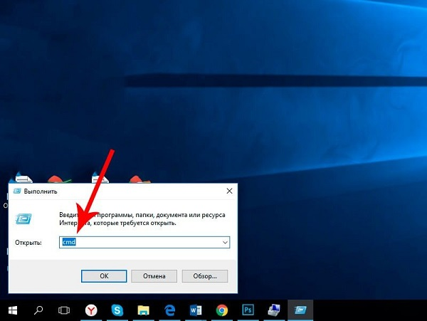

- Terminal (cmd) oynasi ochiladi

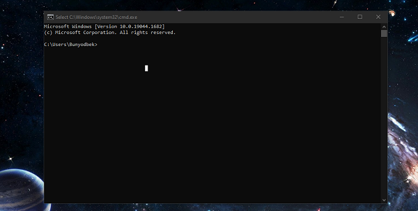

- git yozing va *Enter*-ni bosing

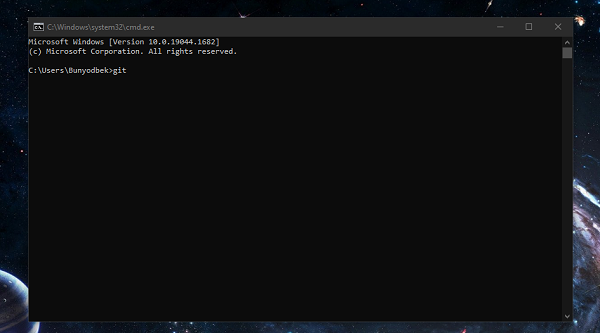

- rasmdagidek xatolik chiqsa siz ushbu manzildan  👉 [GIT](https://git-scm.com/downloads)-ni yuklab oling(__Windows uchun__) va **Ikkinchi bosqich**-ga o'ting

- agar sizda ushbu ko'rinish chiqsa siz **3-bosqichga** o'tishingiz mumkin

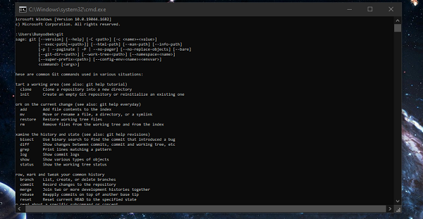

# __Ikkinchi bosqich__
> *Git*-ni o'rnatish
- Rasmlardagi o'zgarishlarni ketma ket bajaring va __install__ qiling 

# __Uchinchi bosqich__
> *SSH* key
- SSH kaliti yordamida biz terminal (cmd) orqali githubga ishonchli tarzda ulanish imkonini beradi
  - yangi terminal (cmd) oching
    - cd Dectop 		(__Ishchi stoliga o'ting__)
      - mkdir .ssh 		(__yangi yashirin papka hosil qiling__)
      	- cd .ssh   	(__hozir yaratgan papka ichiga kiring__)
      	  - ssh-keygen.exe		(__terminal (cmd) -da kalit generatori bor shu yordamida SSH kalit hosil qilamiz__) **Enter** bosing

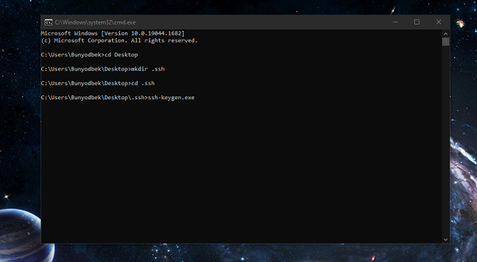

- yaratilayotgan faylni nomlashni suraydi (__! albatta faylni nomlashingiz kerak__)

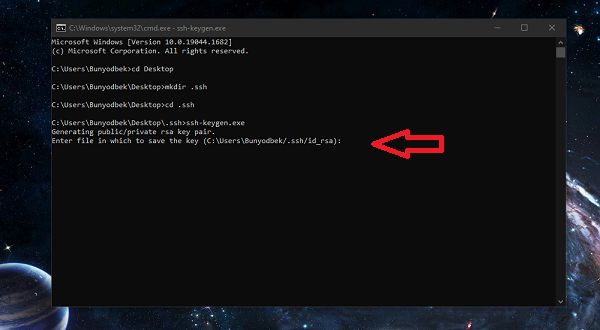

- keyingi ketma ketlikda sizda parol o'rnatishni va uni qayta kiritishni suraydi (__parol majburiy emas Enten-ni bosib o'tkazib yuborishingiz mumkin__) 
  - Sariq kursatkich bilan ko'rsatilgandek belgilar paydo bo'lishi sizga SSH kaliti yaratilganini bildiradi(__rasmda kalit belgilari xavfsizlik uchun  berkitilgan__ 🔐)

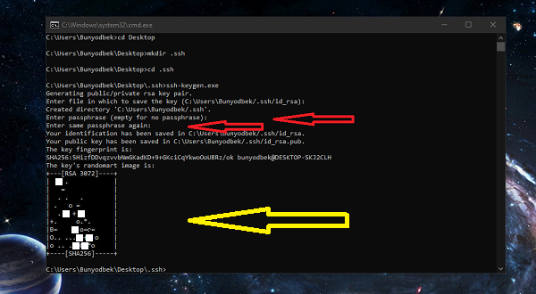

SSH kalitidan foydalanish
- type C:\Users\(__User_nomi__)\Desktop\.ssh\(__faylingiz_nomi__).pub  		(__windows-da cmd orqali faylning mazmunini ko'rish__) 
  - cat C:\Users\(__User_nomi__)\(__Fayl_joylashuvi__)\.ssh\(__faylingiz_nomi__).pub (__macOS-da cmd orqali faylning mazmunini ko'rish__) 
  	- Qizil bilan ko'rsatilgan qismdan nusxa oling **Github**-da ruxsat berish uchun kerak bo'ladi

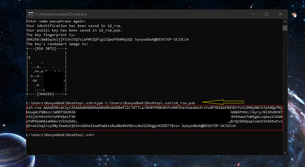

- **GITHUB** shaxsiy profilingizdan __Settings__ bo'limiga o'ting
    - SSH and GPG keys 		(__bo'limini tanlang__)
      - New SSH key 		(__knoplani bosing Key qismiga cmd-da ssh faylni mazmunidan olgan copiyangizni shu yerga yuklang__)

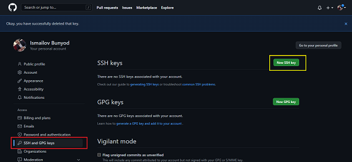

-  Add SSH key (__knopkani bosish orqali uni saqlaysiz__)
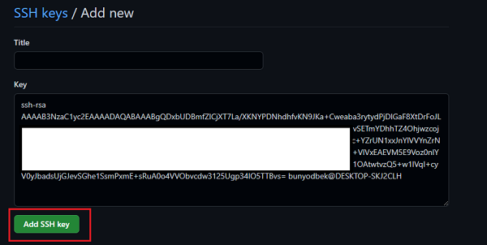

# __To'rtinchi bosqich__
> *Git*-ning terminal (cmd)-da asosiy sozlamalari

- **GIT**-ni to'g'ri ulanishi uchun terminal (cmd) -da ushbu ketma-ketlikni bajarishingiz zarur

    - git config --global user.name "Your Name"             
      -  Git foydanuvchini nomini (username) yozishingiz kerak 

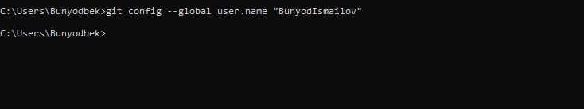

- davom etamiz...
    - git config --global user.email "you@youraddress.com"  
      -  Git- ga ulangan @mail.ru (email) yozishingiz kerak 

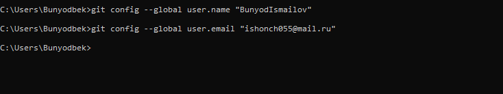

- keyingi ketma ketlik standart sozlamalar 
  - git config --global push.default matching 
  - git config --global alias.co checkout            

# __Sozlamalar tayyor__

# E'tibor uchun raxmat
> savollar bo'lsa [Telegram](https://t.me/foydamizteg_sin) dan yozishingiz mumkin

> Manba [BunyodIsmailov](https://github.com/BunyodIsmailov/BunyodIsmailov-Git-o-rnatish-va-loyihani-yuklash)
